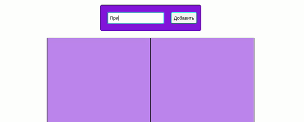

# Финальный проект
# T.R.A.N.S.L.I.T.

## Введение
Тебе предстоит разработать веб-приложение, которое будет превращать текст на русском языке в его транслитерацию и сохранять её в словарик.
С чего начать? Обычно, когда даётся задача в таком абстрактном виде, то её надо разбить на подзадачи. Этот процесс, говоря более умными словами, называется __декомпозиция__. Тебе повезло, мы уже провели декомпозицию - разбили задачу на релизы!

## Releases:

### Release 0. HTML

Для начала необходимо накидать элементы на страницу. Хотелось бы видеть на сайте текстовое поле ввода, кнопку, которая в дальнейшем будет куда-то отправлять текст из поля ввода. Также необходимо добавить 2 блока, в котором будут храниться добавляемые слова. Таким образом эти блоки и будут словарем. Теперь в словарь добавь несколько элементов с каким-либо текстом. Добавленные элементы нужны для того, чтобы ты мог работать со стилями CSS еще до того, как научишь приложение записывать новые слова в словарик по нажатию на кнопку.

### Release 1. Some CSS

Добавь красоты. Сделай словарику красивую границу (`border`), задай ему минимальную высоту(`min-height`). Добавь нестандартный шрифт к полю ввода, а словарю добавь другой нестандартный шрифт. Добавь всем элементам цвета фона и текста, скругления границ, другие свойства по своему желанию.

### Release 2. Flexbox

Сделай так, чтобы все твои элементы располагались по центру по горизонтали и вертикали. Да поможет тебе `flex`!

### Release 3. @media

Уже выглядит неплохо, однако на смартфоне всё отображается не так красиво как хотелось бы. Пусть словарь латиницы и словарь кириллицы выстроены по горизонтали, если приложение запущено с компьютера, и в столбец, если приложение открыто с телефона. Также не забывай менять ширину самих блоков словаря - предусмотри минимум 3 разрешения экрана.

### Release 4. Listener

Пришло время вдохнуть жизнь в твоё приложение. Навесь событие на кнопку, чтобы содержимое текстового поля по нажатию на кнопку выводилось в консоль.

### Release 5. CreateElement

Жизни пока еще мало. Создавай новый элемент div по клику на ту же кнопку, в него добавляй текст из текстового поля. Затем полученный блок с текстом добавь в словарь.

### Release 6. Overflow

Отлично! Сделай так, чтобы текст в элементах внутри словаря обрезался и чтобы в конце обрезанной части текста оставалось троеточие.

### Release 7. Title on :hover

Теперь у тебя проблема! Ты обрезал длинный текст, как же его теперь прочитать? Сделай так, чтобы при наведении на блок слова выводлся весь title во всплывающей подсказке.

### Release 8. Translit teksta
Настало время вспомнить цель твоей задачи. Транслит! После введения слова в текстовое поле и нажатия на кнопку, в левый блок должно добавляться исходное слово, а в правый его транслитерация. Например: `"Проект готов" ---> "Proekt gotov"`.
